# swg

Swift Vector Graphics. `swg` is an independent Swift package for parsing SVG files into a strongly typed model, converting supported geometry into `CGPath`, editing the parsed document tree, and displaying SVG content with `SVG` in SwiftUI.

The package has no third-party dependencies. XML parsing uses Foundation's `XMLParser`, with `FoundationXML` imported on platforms where that module is split out.

## Status

The parser is built around the SVG 2 specification and is tracked by a test-gated checklist in [TODO.md](TODO.md). A checklist item is checked only when there is a focused test for that feature.

Current coverage is strongest in parser/model behavior. The native SwiftUI renderer displays the shape/path/container subset that can already map through `CGPath`; browser-equivalent rendering for text, gradients, filters, masks, clipping, markers, images, and animation is still renderer work in progress even though much of that structure is parsed and modeled.

The matrix below shows one SVG example per visual feature. Each source SVG is parsed by `swg` and rendered to PNG through the package's `SVG` SwiftUI view.

## SVG View Visual Feature Matrix

These images are generated from one SVG per visual feature by `docs/FeatureGallery.playground/Contents.swift`. The playground writes the source SVGs to `docs/feature-gallery/svg`, parses them with `swg`, renders them through the public `SVG` SwiftUI view, and writes PNGs to `docs/feature-gallery/png`.

The parser/model checklist remains in [TODO.md](TODO.md). This matrix is specifically the native SwiftUI renderer truth table: 133 visual examples, 59 currently render through `SVG`, and 74 are intentionally left blank because the feature is parsed/modelled but not actually painted yet.

Not actually rendering yet: gradients and patterns, clipping, masking, filter primitives, native text, markers, vector-effect stroke behavior, rendering hints, embedded HTML inside `foreignObject`, and live animation. Those features are still valuable in the model, but the current `SVG` view either skips them or paints only the static/base geometry.

## Document and Containers

| Feature | Preview | Notes |
| --- | --- | --- |
| Nested &lt;svg&gt; viewport | 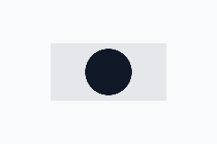 | Nested SVG children paint inside their own viewport. |
| viewBox meet | 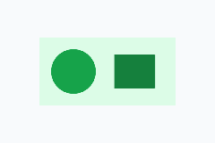 | The document is uniformly fitted into the viewport. |
| preserveAspectRatio none | 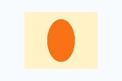 | The nested viewport uses non-uniform scaling. |
| preserveAspectRatio slice | 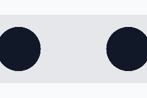 | The nested viewport covers and crops the viewBox. |
| &lt;g&gt; | 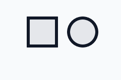 | Groups apply transforms and inherited paint to children. |
| &lt;defs&gt; | 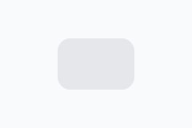 | Definitions stay hidden until referenced. |
| &lt;symbol&gt; + &lt;use&gt; |  | Simple symbol references render through &lt;use&gt;. |
| &lt;switch&gt; | 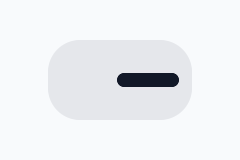 | The selected switch child renders as a normal container. |
| &lt;a&gt; |  | Links render their SVG children; interaction metadata is preserved separately. |
| &lt;view&gt; |  | Predefined views are parsed but are not drawable content. |

## Basic Shapes

| Feature | Preview | Notes |
| --- | --- | --- |
| &lt;path&gt; element | 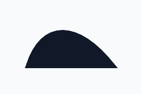 | Path elements render through CGPath. |
| &lt;rect&gt; |  | Rectangles render with fill and stroke. |
| &lt;rect rx&gt; | 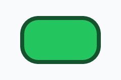 | Rounded x radius is converted into the path. |
| &lt;rect ry&gt; |  | Rounded y radius is converted into the path. |
| &lt;circle&gt; | 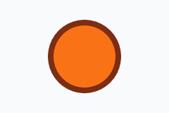 | Circles render as CGPath ellipses. |
| &lt;ellipse&gt; | 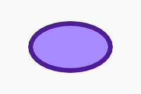 | Ellipses render as CGPath ellipses. |
| &lt;line&gt; | 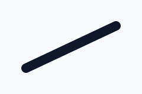 | Lines render as stroked paths. |
| &lt;polyline&gt; |  | Polylines render as open stroked paths. |
| &lt;polygon&gt; | 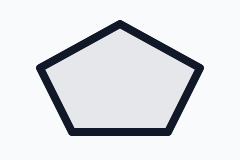 | Polygons render as closed paths. |

## Path Data

| Feature | Preview | Notes |
| --- | --- | --- |
| M/L commands |  | Moveto and lineto path commands paint. |
| H command | 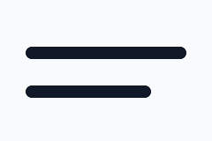 | Horizontal line commands paint. |
| V command |  | Vertical line commands paint. |
| C command |  | Cubic Bezier commands paint. |
| S command |  | Smooth cubic commands paint after cubic control reflection. |
| Q command |  | Quadratic Bezier commands paint. |
| T command |  | Smooth quadratic commands paint. |
| A command |  | Elliptical arcs are converted to cubic path segments. |
| Z command | 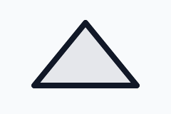 | Closepath fills and closes the outline. |
| Implicit repeated commands |  | Repeated command parameters become additional path segments. |

## Coordinate Systems and Transforms

| Feature | Preview | Notes |
| --- | --- | --- |
| matrix() | 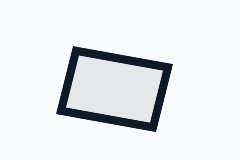 | Matrix transforms are applied before painting. |
| translate() | 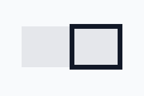 | Translation moves rendered geometry. |
| scale() | 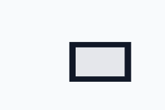 | Scaling affects the painted path. |
| rotate(angle) | 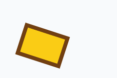 | Rotation around the origin is applied. |
| rotate(angle cx cy) | 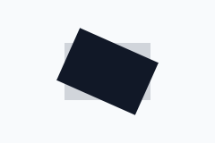 | Centered rotation is applied around the provided pivot. |
| skewX() | 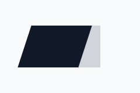 | Horizontal skew transforms paint. |
| skewY() | 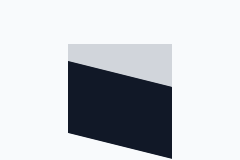 | Vertical skew transforms paint. |
| vector-effect |  | Vector-effect is parsed but the renderer does not keep strokes non-scaling. |

## Styling and Cascade

| Feature | Preview | Notes |
| --- | --- | --- |
| Inline style |  | Inline style declarations feed native paint attributes. |
| &lt;style&gt; | 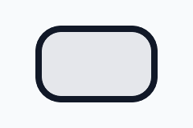 | Simple matching style rules affect painted geometry. |
| &lt;style media&gt; |  | Matching media-filtered rules are applied by the parser. |

## Painting

| Feature | Preview | Notes |
| --- | --- | --- |
| fill | 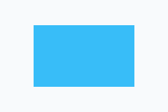 | Solid fill paint renders. |
| fill-opacity | 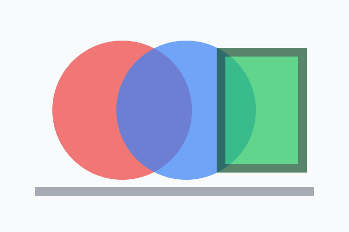 | Fill opacity multiplies solid paint. |
| fill-rule nonzero | 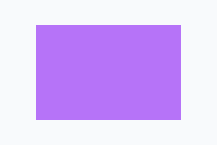 | Nonzero fill rule paints nested winding normally. |
| fill-rule evenodd | 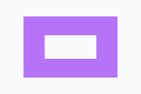 | Even-odd fill rule cuts out the inner path. |
| stroke | 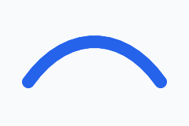 | Solid stroke paint renders. |
| stroke-width | 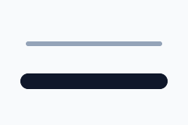 | Stroke width affects painted outlines. |
| stroke-opacity | 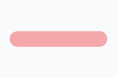 | Stroke opacity multiplies stroke paint. |
| stroke-linecap butt | 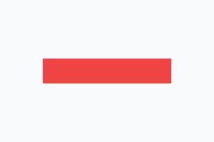 | Butt caps end exactly on the path endpoints. |
| stroke-linecap round | 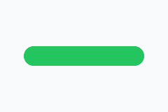 | Round caps extend the path with semicircles. |
| stroke-linecap square | 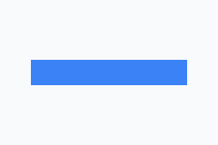 | Square caps extend the path with square ends. |
| stroke-linejoin miter |  | Miter joins create pointed corners. |
| stroke-linejoin round |  | Round joins create curved corners. |
| stroke-linejoin bevel |  | Bevel joins flatten corners. |
| stroke-miterlimit |  | Miter limit affects sharp stroked corners. |
| stroke-dasharray | 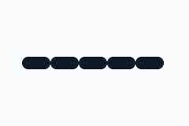 | Dash arrays are passed to SwiftUI stroke style. |
| stroke-dashoffset | 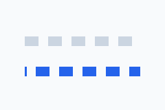 | Dash offsets shift the dash phase. |
| paint-order | 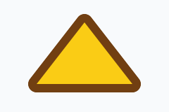 | Paint order is honored for fill and stroke; marker painting is skipped. |
| currentColor |  | currentColor resolves into fill or stroke paint. |
| rendering hints |  | Color, shape, text, and image rendering hints are parsed but do not change native output. |

## Gradients and Patterns

| Feature | Preview | Notes |
| --- | --- | --- |
| &lt;linearGradient&gt; |  | URL paint servers are parsed but skipped by the renderer. |
| &lt;radialGradient&gt; |  | Radial gradient paint is parsed but not painted. |
| &lt;stop&gt; offset |  | Stop offsets are model data until gradient rendering exists. |
| stop-opacity |  | Stop opacity is parsed but has no effect without gradient paint. |
| gradientUnits objectBoundingBox |  | Object-bounding-box gradient units are preserved but not rendered. |
| gradientUnits userSpaceOnUse |  | User-space gradient units are preserved but not rendered. |
| gradientTransform |  | Gradient transforms are parsed but skipped by native paint. |
| spreadMethod pad |  | Spread methods are parsed but not rendered. |
| spreadMethod reflect |  | Reflect spread is model-only today. |
| spreadMethod repeat |  | Repeat spread is model-only today. |
| &lt;pattern&gt; |  | Pattern paint servers are parsed but skipped. |
| patternContentUnits |  | Pattern content unit mapping is preserved but not painted. |

## Clipping, Masking, and Compositing

| Feature | Preview | Notes |
| --- | --- | --- |
| &lt;clipPath&gt; |  | Clip path definitions are parsed but not applied. |
| clip-path |  | The clip-path property is parsed but ignored by the renderer. |
| clip-rule |  | Clip-rule is preserved, but clipping itself is not applied. |
| clipPathUnits |  | Clip path units are model-only today. |
| &lt;mask&gt; |  | Mask definitions are parsed but not applied. |
| mask |  | The mask property is parsed but ignored by native drawing. |
| maskUnits |  | Mask units are preserved but not rendered. |
| maskContentUnits |  | Mask content units are model-only today. |
| opacity | 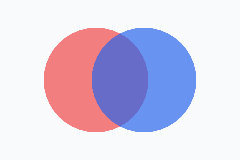 | Element and group opacity are applied while rendering. |

## Filters

| Feature | Preview | Notes |
| --- | --- | --- |
| &lt;filter&gt; |  | filter="url(...)" is parsed but no filter graph is applied. |
| filterUnits |  | Filter coordinate units are parsed but not applied. |
| primitiveUnits |  | Primitive coordinate units are parsed but not applied. |
| &lt;feGaussianBlur&gt; |  | Blur primitives are model-only today. |
| &lt;feDropShadow&gt; |  | Drop shadows are parsed but not rendered. |
| &lt;feBlend&gt; |  | Blend primitives are preserved but skipped. |
| &lt;feColorMatrix&gt; |  | Color matrix primitives are preserved but skipped. |
| &lt;feComponentTransfer&gt; |  | Component transfer primitives are preserved but skipped. |
| &lt;feFuncR&gt; |  | Red channel transfer functions are model-only. |
| &lt;feFuncG&gt; |  | Green channel transfer functions are model-only. |
| &lt;feFuncB&gt; |  | Blue channel transfer functions are model-only. |
| &lt;feFuncA&gt; |  | Alpha channel transfer functions are model-only. |
| &lt;feComposite&gt; |  | Composite primitives are preserved but skipped. |
| &lt;feConvolveMatrix&gt; |  | Convolution primitives are model-only. |
| &lt;feDiffuseLighting&gt; |  | Diffuse lighting primitives are model-only. |
| &lt;feDisplacementMap&gt; |  | Displacement map primitives are model-only. |
| &lt;feDistantLight&gt; |  | Distant light data is parsed inside lighting filters only. |
| &lt;feFlood&gt; |  | Flood primitives are preserved but not rendered. |
| &lt;feImage&gt; |  | Filter image primitives are model-only. |
| &lt;feMerge&gt; |  | Merge primitives are preserved but skipped. |
| &lt;feMergeNode&gt; |  | Merge node ordering is model-only. |
| &lt;feMorphology&gt; |  | Morphology primitives are preserved but skipped. |
| &lt;feOffset&gt; |  | Offset primitives are preserved but skipped. |
| &lt;fePointLight&gt; |  | Point light data is parsed inside lighting filters only. |
| &lt;feSpecularLighting&gt; |  | Specular lighting primitives are model-only. |
| &lt;feSpotLight&gt; |  | Spot light data is parsed inside lighting filters only. |
| &lt;feTile&gt; |  | Tile primitives are model-only. |
| &lt;feTurbulence&gt; |  | Turbulence primitives are model-only. |

## Text

| Feature | Preview | Notes |
| --- | --- | --- |
| &lt;text&gt; |  | Text elements are parsed but native text painting is not implemented. |
| &lt;tspan&gt; |  | Text spans are parsed but not painted. |
| &lt;textPath&gt; |  | TextPath references are parsed but text layout along paths is not painted. |
| text x/y/dx/dy |  | Text positioning lists are model-only until text rendering exists. |
| text rotate |  | Per-glyph text rotation is parsed but not painted. |
| text-anchor |  | Text anchoring is parsed but not painted. |
| dominant-baseline |  | Dominant baseline is parsed but not painted. |
| alignment-baseline |  | Alignment baseline is parsed but not painted. |
| white-space |  | Text whitespace handling is parsed but not painted. |

## Reuse, Linking, and Markers

| Feature | Preview | Notes |
| --- | --- | --- |
| href | 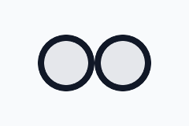 | Unprefixed href works for simple &lt;use&gt; references. |
| xlink:href | 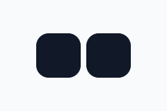 | Deprecated xlink:href is preserved and works for simple &lt;use&gt; references. |
| &lt;marker&gt; |  | Marker definitions are parsed but marker painting is skipped. |
| marker-start |  | Start markers are parsed but not painted. |
| marker-mid |  | Mid markers are parsed but not painted. |
| marker-end |  | End markers are parsed but not painted. |
| marker orient |  | Marker orientation is parsed but has no renderer effect. |
| markerUnits |  | Marker unit scaling is parsed but not painted. |
| marker viewBox |  | Marker viewBox data is parsed but not rendered. |

## Embedded and Dynamic SVG

| Feature | Preview | Notes |
| --- | --- | --- |
| &lt;foreignObject&gt; |  | The container's SVG children can render; embedded HTML is not painted. |
| &lt;animate&gt; |  | Animation records are parsed; the native view paints the initial static geometry only. |
| &lt;animateMotion&gt; |  | Motion animation is parsed but not executed. |
| &lt;animateTransform&gt; |  | Transform animation is parsed but not executed. |
| &lt;set&gt; |  | Set animation elements are parsed but do not mutate rendered output. |
| &lt;discard&gt; |  | Discard elements are parsed but do not remove rendered content. |
| &lt;mpath&gt; |  | Motion path references are parsed but not animated. |

## Installation

Add `swg` to a Swift Package:

```swift
dependencies: [
	.package(url: "https://github.com/eliseyOzerov/swg.git", branch: "main"),
]
```

Then add the product to your target:

```swift
.target(
	name: "YourTarget",
	dependencies: [
		.product(name: "Swg", package: "swg"),
	]
)
```

## Displaying SVG

Use `SVG` when you already have an `SVGDocument`:

```swift
import SwiftUI
import Swg

struct IconPreview: View {
	let document: SVGDocument

	var body: some View {
		SVG(document)
			.frame(width: 120, height: 120)
	}
}
```

You can also construct a view directly from SVG source:

```swift
let source = """
<svg xmlns="http://www.w3.org/2000/svg" viewBox="0 0 24 24">
	<circle id="dot" cx="12" cy="12" r="6" fill="#336699"/>
</svg>
"""

if let view = SVG(source: source) {
	view.frame(width: 48, height: 48)
}
```

Or let the view load SVG XML after it appears:

```swift
SVG("checkmark")
SVG("Icons/checkmark.svg", bundle: .main)
SVG(url: URL(string: "https://example.com/icons/check.svg")!)
SVG(file: cachedSVGURL)
```

Use the `document` binding variants when the parsed document should become part of your app state:

```swift
struct RemoteIcon: View {
	let iconURL: URL
	@State private var document: SVGDocument?

	var body: some View {
		SVG(url: iconURL, document: $document)
			.onChange(of: document) { _, document in
				guard let document else { return }
				self.document = document.modifyingElement(id: "mark") { element in
					element.modifyingAttributes { attributes in
						attributes.stroke = .color(.red)
					}
				}
			}
	}
}
```

`SVGRenderOptions` controls SwiftUI layout and root mapping:

```swift
SVG(
	document,
	options: SVGRenderOptions(
		contentMode: .fit,
		preserveAspectRatio: .default,
		opacity: 0.8
	)
)
```

The current renderer supports native drawing for paths, rectangles, circles, ellipses, lines, polygons, polylines, groups, links, nested SVG viewports, `switch`, `foreignObject` SVG children, unknown SVG containers, and simple `use` references. Unsupported visual paint servers and advanced effects are preserved in the model but skipped by the SwiftUI renderer for now.

## Parsing

Use `SVGParser` to turn SVG XML into an `SVGDocument`:

```swift
import Swg

let source = """
<svg xmlns="http://www.w3.org/2000/svg" viewBox="0 0 24 24">
	<path id="mark" d="M4 12 L10 18 L20 6" fill="none" stroke="blue"/>
</svg>
"""

guard let document = SVGParser().parse(source) else {
	return
}

print(document.viewBox)
print(document.elementIDs)
```

`SVGDocument` exposes the root view box, root elements, definitions, metadata, animation records, scripts, and preserved unknown attributes. The element tree is represented by `SVGElement`, with typed data records for shapes, containers, text, images, links, definitions, filters, gradients, patterns, masks, clips, and other SVG constructs.

## Controlling the Document

`SVGDocument` is regular Swift data. You can look up elements by `id`, map the tree, and edit presentation attributes before rendering:

```swift
let highlighted = document.modifyingElement(id: "mark") { element in
	element.modifyingAttributes { attributes in
		attributes.stroke = .color(.red)
		attributes.strokeWidth = 3
		attributes.transform = attributes.transform.scaledBy(x: 1.15, y: 1.15)
	}
}

SVG(highlighted)
```

For broad changes, map every element recursively:

```swift
let muted = document.mapElements { element in
	element.modifyingAttributes { attributes in
		attributes.opacity *= 0.5
	}
}
```

This is the intended control surface for stateful SwiftUI usage: keep the source SVG as a parsed document, derive edited copies from app state, then render the copy with `SVG`.

## Paths

SVG path data is parsed into the package's editable `Path` model:

```swift
let path = Path(svgPathData: "M0 0 H10 V10 Z")
let roundTripped = path.svgPathData()
```

Shape data types that have direct geometry can also expose equivalent paths:

```swift
if case .rect(let rect) = document.elements.first {
	let path = rect.path
	let cgPath = path.cgPath
	print(cgPath.boundingBox)
}
```

These helpers are the geometry bridge used by the SwiftUI renderer and by callers that want to feed SVG geometry into CoreGraphics directly.

## Validation

Run the package's iOS simulator test gate with:

```sh
xcodebuild test -scheme swg -destination 'platform=iOS Simulator,name=iPhone 17 Pro'
```

The suite contains focused parser/model tests, public rendering API tests, document-control tests, and fixture-backed visual tests.

## Documentation

API and conceptual reference lives in the DocC catalog at `Sources/Swg/Documentation.docc`. In Xcode, build documentation for the `swg` scheme to browse the module reference.
