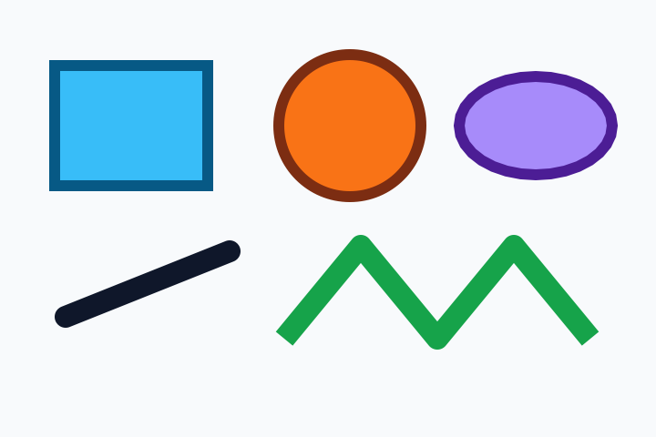
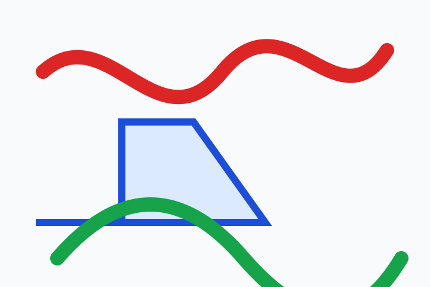
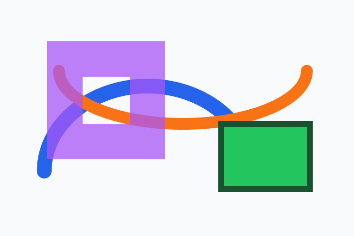
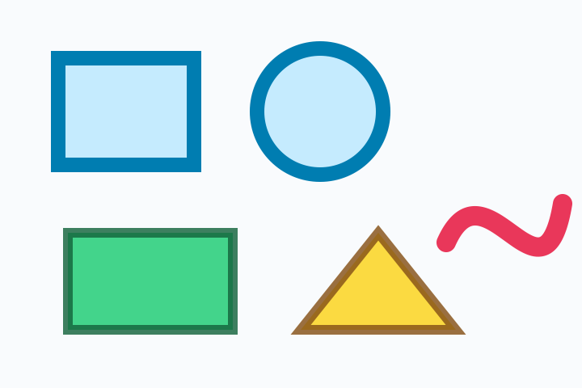
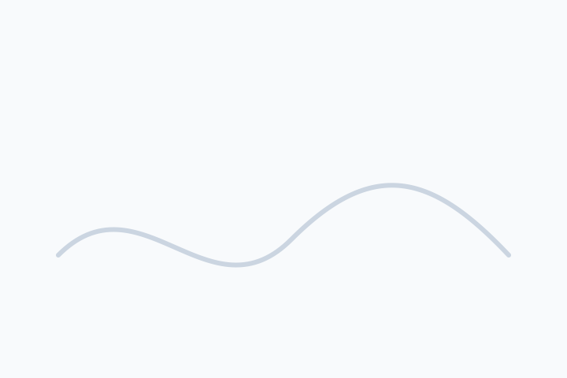
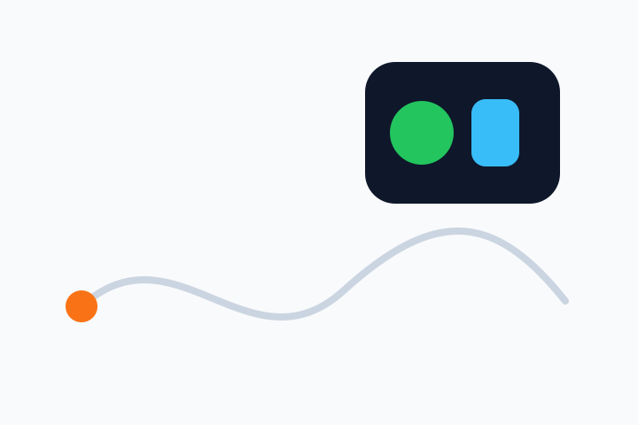

# swg

Swift Vector Graphics. `swg` is an independent Swift package for parsing SVG files into a strongly typed model, converting supported geometry into `CGPath`, editing the parsed document tree, and displaying SVG content with `SVGView`/`SWGView` in SwiftUI.

The package has no third-party dependencies. XML parsing uses Foundation's `XMLParser`, with `FoundationXML` imported on platforms where that module is split out.

## Status

The parser is built around the SVG 2 specification and is tracked by a test-gated checklist in [TODO.md](TODO.md). A checklist item is checked only when there is a focused test for that feature.

Current coverage is strongest in parser/model behavior. The native SwiftUI renderer displays the shape/path/container subset that can already map through `CGPath`; browser-equivalent rendering for text, gradients, filters, masks, clipping, markers, images, and animation is still renderer work in progress even though much of that structure is parsed and modeled.

The gallery below shows visual TODO groups with SVG examples that are parsed by `swg` and rasterized to PNG by a Swift playground.

## Supported Feature Gallery

These images are generated from SVG files in `docs/feature-gallery/svg` by `docs/FeatureGallery.playground/Contents.swift`. The playground parses each SVG with `swg`, then uses macOS Quick Look to rasterize the SVG and writes PNGs to `docs/feature-gallery/png`.

Parser support is broader than this gallery; see [TODO.md](TODO.md) for the full test-gated checklist. Non-visual items such as metadata selection, script preservation, pointer-event values, and raw animation timing records stay in focused tests rather than being treated as visual output.

### Document, Viewport, and Container Features

Supported here: nested `<svg>` viewports, `viewBox`, `preserveAspectRatio`, `<g>`, `<defs>`, `<symbol>`, `<use>`, `<switch>`, and `<a>`.

<p>
	
</p>

### Basic Shapes

Supported here: `<rect>`, rounded rectangles, `<circle>`, `<ellipse>`, `<line>`, `<polyline>`, `<polygon>`, fills, strokes, line caps, and line joins.

<p>
	
	
</p>

### Path Data

Supported here: `M`, `L`, `H`, `V`, `C`, `S`, `Q`, `T`, `A`, `Z`, implicit close/fill behavior, and `fill-rule="evenodd"`.

<p>
	
	
</p>

### Coordinate Systems, Transforms, and Style

Supported here: transform list ordering, `matrix`, `translate`, `scale`, `rotate`, centered rotation, `skewX`, `skewY`, inherited presentation attributes, inline `style`, `<style>`, and media-filtered style rules.

<p>
	
</p>

### Paint and Strokes

Supported here: solid color fill, `fill-opacity`, `fill-rule`, stroke paint, `stroke-width`, `stroke-opacity`, `stroke-linecap`, `stroke-linejoin`, `stroke-miterlimit`, `stroke-dasharray`, `stroke-dashoffset`, `paint-order`, `color`, and rendering hint values.

<p>
	
	
</p>

### Gradients and Patterns

Supported here: `<linearGradient>`, `<radialGradient>`, `<stop>`, `stop-color`, `stop-opacity`, `gradientUnits`, `gradientTransform`, `spreadMethod`, `<pattern>`, and `patternContentUnits`.

<p>
	
</p>

### Clipping, Masking, and Compositing

Supported here: `<clipPath>`, `clip-path`, `clip-rule`, `clipPathUnits`, `<mask>`, `mask`, `maskUnits`, `maskContentUnits`, and `opacity`.

<p>
	
</p>

### Filters

Supported here: `<filter>`, `filterUnits`, `primitiveUnits`, `<feGaussianBlur>`, `<feDropShadow>`, `<feBlend>`, `<feColorMatrix>`, `<feComponentTransfer>`, `<feFuncR>`, `<feFuncG>`, `<feFuncB>`, `<feFuncA>`, `<feComposite>`, `<feConvolveMatrix>`, `<feDiffuseLighting>`, `<feDisplacementMap>`, `<feDistantLight>`, `<feFlood>`, `<feImage>`, `<feMerge>`, `<feMergeNode>`, `<feMorphology>`, `<feOffset>`, `<fePointLight>`, `<feSpecularLighting>`, `<feSpotLight>`, `<feTile>`, and `<feTurbulence>`.

<p>
	
</p>

### Text

Supported here: `<text>`, `<tspan>`, `<textPath>`, text `x`, `y`, `dx`, `dy`, `rotate`, `text-anchor`, `dominant-baseline`, `alignment-baseline`, and `white-space`.

<p>
	
</p>

### Reuse, Linking, and Markers

Supported here: `href`, `xlink:href`, `<marker>`, `marker-start`, `marker-mid`, `marker-end`, `orient`, `markerUnits`, and marker `viewBox`.

<p>
	
</p>

### Embedded and Dynamic SVG

Visual/model coverage here: `<foreignObject>`, `<animate>`, `<animateMotion>`, `<animateTransform>`, `<set>`, `<discard>`, and `<mpath>`. Related non-visual checked items such as timing attributes, value control attributes, additive/accumulate records, `<script>`, and `pointer-events` remain covered by focused parser tests.

<p>
	
</p>

## Installation

Add `swg` to a Swift Package:

```swift
dependencies: [
	.package(url: "https://github.com/eliseyOzerov/swg.git", branch: "main"),
]
```

Then add the product to your target:

```swift
.target(
	name: "YourTarget",
	dependencies: [
		.product(name: "Swg", package: "swg"),
	]
)
```

## Displaying SVG

Use `SVGView` when you already have an `SVGDocument`, or `SWGView` if you prefer the package-flavored alias:

```swift
import SwiftUI
import Swg

struct IconPreview: View {
	let document: SVGDocument

	var body: some View {
		SWGView(document)
			.frame(width: 120, height: 120)
	}
}
```

You can also construct a view directly from SVG source:

```swift
let source = """
<svg xmlns="http://www.w3.org/2000/svg" viewBox="0 0 24 24">
	<circle id="dot" cx="12" cy="12" r="6" fill="#336699"/>
</svg>
"""

if let view = SVGView(svg: source) {
	view.frame(width: 48, height: 48)
}
```

`SVGRenderOptions` controls SwiftUI layout and root mapping:

```swift
SVGView(
	document,
	options: SVGRenderOptions(
		contentMode: .fit,
		preserveAspectRatio: .default,
		opacity: 0.8
	)
)
```

The current renderer supports native drawing for paths, rectangles, circles, ellipses, lines, polygons, polylines, groups, links, nested SVG viewports, `switch`, `foreignObject` SVG children, unknown SVG containers, and simple `use` references. Unsupported visual paint servers and advanced effects are preserved in the model but skipped by the SwiftUI renderer for now.

## Parsing

Use `SVGParser` to turn SVG XML into an `SVGDocument`:

```swift
import Swg

let source = """
<svg xmlns="http://www.w3.org/2000/svg" viewBox="0 0 24 24">
	<path id="mark" d="M4 12 L10 18 L20 6" fill="none" stroke="blue"/>
</svg>
"""

guard let document = SVGParser().parse(source) else {
	return
}

print(document.viewBox)
print(document.elementIDs)
```

`SVGDocument` exposes the root view box, root elements, definitions, metadata, animation records, scripts, and preserved unknown attributes. The element tree is represented by `SVGElement`, with typed data records for shapes, containers, text, images, links, definitions, filters, gradients, patterns, masks, clips, and other SVG constructs.

## Controlling the Document

`SVGDocument` is regular Swift data. You can look up elements by `id`, map the tree, and edit presentation attributes before rendering:

```swift
let highlighted = document.modifyingElement(id: "mark") { element in
	element.modifyingAttributes { attributes in
		attributes.stroke = .color(.red)
		attributes.strokeWidth = 3
		attributes.transform = attributes.transform.scaledBy(x: 1.15, y: 1.15)
	}
}

SWGView(highlighted)
```

For broad changes, map every element recursively:

```swift
let muted = document.mapElements { element in
	element.modifyingAttributes { attributes in
		attributes.opacity *= 0.5
	}
}
```

This is the intended control surface for stateful SwiftUI usage: keep the source SVG as a parsed document, derive edited copies from app state, then render the copy with `SVGView`.

## Paths

SVG path data is parsed into the package's editable `Path` model:

```swift
let path = Path(svgPathData: "M0 0 H10 V10 Z")
let roundTripped = path.svgPathData()
```

Shape data types that have direct geometry can also expose equivalent paths:

```swift
if case .rect(let rect) = document.elements.first {
	let path = rect.path
	let cgPath = path.cgPath
	print(cgPath.boundingBox)
}
```

These helpers are the geometry bridge used by the SwiftUI renderer and by callers that want to feed SVG geometry into CoreGraphics directly.

## Styling

Paint and presentation attributes are collected in `SVGPaintAttributes`. The parser handles presentation attributes, inline style declarations, basic cascade/inheritance behavior, transform lists, colors, paint references, opacity, fill rules, stroke properties, markers, clipping, masks, filters, rendering hints, visibility, display, vector effects, and pointer events.

## Validation

Run the package's iOS simulator test gate with:

```sh
xcodebuild test -scheme swg -destination 'platform=iOS Simulator,name=iPhone 17 Pro'
```

The suite contains focused parser/model tests, public rendering API tests, document-control tests, and fixture-backed visual tests.

## Documentation

API and conceptual reference lives in the DocC catalog at `Sources/Swg/Documentation.docc`. In Xcode, build documentation for the `swg` scheme to browse the module reference.
