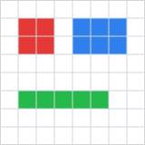
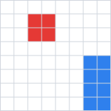

# swg

Swift Vector Graphics. `swg` is an independent Swift package for parsing SVG files into a strongly typed model that can feed `CGPath` conversion and, over time, an `SWG` SwiftUI view.

The package has no third-party dependencies. XML parsing uses Foundation's `XMLParser`, with `FoundationXML` imported on platforms where that module is split out.

## Status

The parser is built around the SVG 2 specification and is tracked by a test-gated checklist in [TODO.md](TODO.md). A checklist item is checked only when there is a focused test for that feature.

Current coverage is parser/model coverage, not full browser-equivalent rendering. Render-affecting behavior is now being promoted into a second visual validation layer so the package can move from "we parsed the spec field" toward "we can render the expected vector output."

## Installation

Add `swg` to a Swift Package:

```swift
dependencies: [
	.package(url: "https://github.com/eliseyOzerov/swg.git", branch: "main"),
]
```

Then add the product to your target:

```swift
.target(
	name: "YourTarget",
	dependencies: [
		.product(name: "Swg", package: "swg"),
	]
)
```

## Parsing

Use `SVGParser` to turn SVG XML into an `SVGDocument`:

```swift
import Swg

let source = """
<svg xmlns="http://www.w3.org/2000/svg" viewBox="0 0 24 24">
	<path id="mark" d="M4 12 L10 18 L20 6" fill="none" stroke="blue"/>
</svg>
"""

guard let document = SVGParser().parse(source) else {
	return
}

print(document.viewBox)
print(document.elementIDs)
```

`SVGDocument` exposes the root view box, root elements, definitions, metadata, animation records, scripts, and preserved unknown attributes. The element tree is represented by `SVGElement`, with typed data records for shapes, containers, text, images, links, definitions, filters, gradients, patterns, masks, clips, and other SVG constructs.

## Paths

SVG path data is parsed into the package's editable `Path` model:

```swift
let path = Path(svgPathData: "M0 0 H10 V10 Z")
let roundTripped = path.svgPathData()
```

Shape data types that have direct geometry can also expose equivalent paths:

```swift
if case .rect(let rect) = document.elements.first {
	let path = rect.path
	print(path.commands)
}
```

These helpers are the bridge toward platform renderers. The package model is platform-neutral; CoreGraphics conversion currently lives in tests as validation scaffolding rather than public API.

## Styling

Paint and presentation attributes are collected in `SVGPaintAttributes`. The parser handles presentation attributes, inline style declarations, basic cascade/inheritance behavior, transform lists, colors, paint references, opacity, fill rules, stroke properties, markers, clipping, masks, filters, rendering hints, visibility, display, vector effects, and pointer events.

## Validation

Run the package's iOS simulator test gate with:

```sh
xcodebuild test -scheme swg -destination 'platform=iOS Simulator,name=iPhone 17 Pro'
```

The suite contains focused parser/model tests plus fixture-backed visual tests.

## Visual Tests

Visual validation lives in `Tests/SwgTests/SVGVisualValidationTests.swift`. Each visual case pairs an SVG fixture with a text golden:

| Test | Expected raster |
| --- | --- |
| `basic-paint` |  |
| `transforms` |  |

```text
Tests/SwgTests/VisualFixtures/basic-paint.svg
Tests/SwgTests/VisualFixtures/basic-paint.golden.txt
```

The test rasterizer parses the SVG, renders the supported visual subset into a deterministic CoreGraphics bitmap with antialiasing disabled, then compares the output against the golden rows. Golden files are written top-to-bottom in SVG/user-space order.

Golden symbols:

```text
. transparent
W white
R red
G green
B blue
? opaque color outside the named buckets
```

Current starter fixtures cover basic paint and transform behavior. As rendering support grows, render-affecting spec items should receive visual fixtures in addition to their focused parser tests. Purely structural or metadata features can stay parser-only unless they affect rendered output.

## Documentation

API and conceptual reference lives in the DocC catalog at `Sources/Swg/Documentation.docc`. In Xcode, build documentation for the `swg` scheme to browse the module reference.
