# SVG View Visual Feature Matrix

Generated by `docs/FeatureGallery.playground/Contents.swift`. Each SVG is parsed by `swg` and rendered through the public `SVG` SwiftUI view.

| Category | Feature | Renderer | Preview | Notes |
| --- | --- | --- | --- | --- |
| Document and Containers | Nested &lt;svg&gt; viewport | Rendered |  | Nested SVG children paint inside their own viewport. |
| Document and Containers | viewBox meet | Rendered |  | The document is uniformly fitted into the viewport. |
| Document and Containers | preserveAspectRatio none | Rendered |  | The nested viewport uses non-uniform scaling. |
| Document and Containers | preserveAspectRatio slice | Rendered |  | The nested viewport covers and crops the viewBox. |
| Document and Containers | &lt;g&gt; | Rendered |  | Groups apply transforms and inherited paint to children. |
| Document and Containers | &lt;defs&gt; | Rendered |  | Definitions stay hidden until referenced. |
| Document and Containers | &lt;symbol&gt; + &lt;use&gt; | Rendered |  | Simple symbol references render through &lt;use&gt;. |
| Document and Containers | &lt;switch&gt; | Rendered |  | The selected switch child renders as a normal container. |
| Document and Containers | &lt;a&gt; | Rendered |  | Links render their SVG children; interaction metadata is preserved separately. |
| Document and Containers | &lt;view&gt; | Model only | 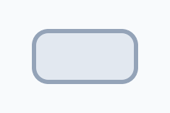 | Predefined views are parsed but are not drawable content. |
| Basic Shapes | &lt;path&gt; element | Rendered |  | Path elements render through CGPath. |
| Basic Shapes | &lt;rect&gt; | Rendered |  | Rectangles render with fill and stroke. |
| Basic Shapes | &lt;rect rx&gt; | Rendered |  | Rounded x radius is converted into the path. |
| Basic Shapes | &lt;rect ry&gt; | Rendered |  | Rounded y radius is converted into the path. |
| Basic Shapes | &lt;circle&gt; | Rendered |  | Circles render as CGPath ellipses. |
| Basic Shapes | &lt;ellipse&gt; | Rendered |  | Ellipses render as CGPath ellipses. |
| Basic Shapes | &lt;line&gt; | Rendered |  | Lines render as stroked paths. |
| Basic Shapes | &lt;polyline&gt; | Rendered |  | Polylines render as open stroked paths. |
| Basic Shapes | &lt;polygon&gt; | Rendered |  | Polygons render as closed paths. |
| Path Data | M/L commands | Rendered |  | Moveto and lineto path commands paint. |
| Path Data | H command | Rendered |  | Horizontal line commands paint. |
| Path Data | V command | Rendered |  | Vertical line commands paint. |
| Path Data | C command | Rendered |  | Cubic Bezier commands paint. |
| Path Data | S command | Rendered |  | Smooth cubic commands paint after cubic control reflection. |
| Path Data | Q command | Rendered |  | Quadratic Bezier commands paint. |
| Path Data | T command | Rendered |  | Smooth quadratic commands paint. |
| Path Data | A command | Rendered |  | Elliptical arcs are converted to cubic path segments. |
| Path Data | Z command | Rendered |  | Closepath fills and closes the outline. |
| Path Data | Implicit repeated commands | Rendered |  | Repeated command parameters become additional path segments. |
| Coordinate Systems and Transforms | matrix() | Rendered |  | Matrix transforms are applied before painting. |
| Coordinate Systems and Transforms | translate() | Rendered |  | Translation moves rendered geometry. |
| Coordinate Systems and Transforms | scale() | Rendered |  | Scaling affects the painted path. |
| Coordinate Systems and Transforms | rotate(angle) | Rendered |  | Rotation around the origin is applied. |
| Coordinate Systems and Transforms | rotate(angle cx cy) | Rendered |  | Centered rotation is applied around the provided pivot. |
| Coordinate Systems and Transforms | skewX() | Rendered |  | Horizontal skew transforms paint. |
| Coordinate Systems and Transforms | skewY() | Rendered |  | Vertical skew transforms paint. |
| Coordinate Systems and Transforms | vector-effect | Model only |  | Vector-effect is parsed but the renderer does not keep strokes non-scaling. |
| Styling and Cascade | Inline style | Rendered |  | Inline style declarations feed native paint attributes. |
| Styling and Cascade | &lt;style&gt; | Rendered |  | Simple matching style rules affect painted geometry. |
| Styling and Cascade | &lt;style media&gt; | Rendered |  | Matching media-filtered rules are applied by the parser. |
| Painting | fill | Rendered |  | Solid fill paint renders. |
| Painting | fill-opacity | Rendered |  | Fill opacity multiplies solid paint. |
| Painting | fill-rule nonzero | Rendered |  | Nonzero fill rule paints nested winding normally. |
| Painting | fill-rule evenodd | Rendered |  | Even-odd fill rule cuts out the inner path. |
| Painting | stroke | Rendered |  | Solid stroke paint renders. |
| Painting | stroke-width | Rendered |  | Stroke width affects painted outlines. |
| Painting | stroke-opacity | Rendered |  | Stroke opacity multiplies stroke paint. |
| Painting | stroke-linecap butt | Rendered |  | Butt caps end exactly on the path endpoints. |
| Painting | stroke-linecap round | Rendered |  | Round caps extend the path with semicircles. |
| Painting | stroke-linecap square | Rendered |  | Square caps extend the path with square ends. |
| Painting | stroke-linejoin miter | Rendered |  | Miter joins create pointed corners. |
| Painting | stroke-linejoin round | Rendered |  | Round joins create curved corners. |
| Painting | stroke-linejoin bevel | Rendered |  | Bevel joins flatten corners. |
| Painting | stroke-miterlimit | Rendered |  | Miter limit affects sharp stroked corners. |
| Painting | stroke-dasharray | Rendered |  | Dash arrays are passed to SwiftUI stroke style. |
| Painting | stroke-dashoffset | Rendered |  | Dash offsets shift the dash phase. |
| Painting | paint-order | Rendered |  | Paint order is honored for fill and stroke; marker painting is skipped. |
| Painting | currentColor | Rendered |  | currentColor resolves into fill or stroke paint. |
| Painting | rendering hints | Model only |  | Color, shape, text, and image rendering hints are parsed but do not change native output. |
| Gradients and Patterns | &lt;linearGradient&gt; | Model only |  | URL paint servers are parsed but skipped by the renderer. |
| Gradients and Patterns | &lt;radialGradient&gt; | Model only |  | Radial gradient paint is parsed but not painted. |
| Gradients and Patterns | &lt;stop&gt; offset | Model only |  | Stop offsets are model data until gradient rendering exists. |
| Gradients and Patterns | stop-opacity | Model only |  | Stop opacity is parsed but has no effect without gradient paint. |
| Gradients and Patterns | gradientUnits objectBoundingBox | Model only | 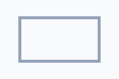 | Object-bounding-box gradient units are preserved but not rendered. |
| Gradients and Patterns | gradientUnits userSpaceOnUse | Model only |  | User-space gradient units are preserved but not rendered. |
| Gradients and Patterns | gradientTransform | Model only |  | Gradient transforms are parsed but skipped by native paint. |
| Gradients and Patterns | spreadMethod pad | Model only |  | Spread methods are parsed but not rendered. |
| Gradients and Patterns | spreadMethod reflect | Model only | 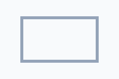 | Reflect spread is model-only today. |
| Gradients and Patterns | spreadMethod repeat | Model only | 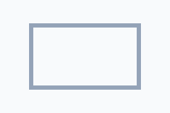 | Repeat spread is model-only today. |
| Gradients and Patterns | &lt;pattern&gt; | Model only |  | Pattern paint servers are parsed but skipped. |
| Gradients and Patterns | patternContentUnits | Model only | 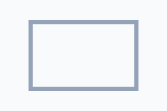 | Pattern content unit mapping is preserved but not painted. |
| Clipping, Masking, and Compositing | &lt;clipPath&gt; | Model only |  | Clip path definitions are parsed but not applied. |
| Clipping, Masking, and Compositing | clip-path | Model only |  | The clip-path property is parsed but ignored by the renderer. |
| Clipping, Masking, and Compositing | clip-rule | Model only | 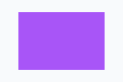 | Clip-rule is preserved, but clipping itself is not applied. |
| Clipping, Masking, and Compositing | clipPathUnits | Model only | 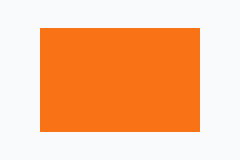 | Clip path units are model-only today. |
| Clipping, Masking, and Compositing | &lt;mask&gt; | Model only |  | Mask definitions are parsed but not applied. |
| Clipping, Masking, and Compositing | mask | Model only |  | The mask property is parsed but ignored by native drawing. |
| Clipping, Masking, and Compositing | maskUnits | Model only |  | Mask units are preserved but not rendered. |
| Clipping, Masking, and Compositing | maskContentUnits | Model only | 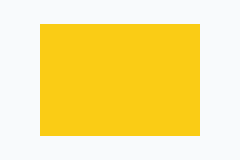 | Mask content units are model-only today. |
| Clipping, Masking, and Compositing | opacity | Rendered |  | Element and group opacity are applied while rendering. |
| Filters | &lt;filter&gt; | Model only |  | filter="url(...)" is parsed but no filter graph is applied. |
| Filters | filterUnits | Model only |  | Filter coordinate units are parsed but not applied. |
| Filters | primitiveUnits | Model only |  | Primitive coordinate units are parsed but not applied. |
| Filters | &lt;feGaussianBlur&gt; | Model only |  | Blur primitives are model-only today. |
| Filters | &lt;feDropShadow&gt; | Model only |  | Drop shadows are parsed but not rendered. |
| Filters | &lt;feBlend&gt; | Model only |  | Blend primitives are preserved but skipped. |
| Filters | &lt;feColorMatrix&gt; | Model only |  | Color matrix primitives are preserved but skipped. |
| Filters | &lt;feComponentTransfer&gt; | Model only |  | Component transfer primitives are preserved but skipped. |
| Filters | &lt;feFuncR&gt; | Model only |  | Red channel transfer functions are model-only. |
| Filters | &lt;feFuncG&gt; | Model only |  | Green channel transfer functions are model-only. |
| Filters | &lt;feFuncB&gt; | Model only |  | Blue channel transfer functions are model-only. |
| Filters | &lt;feFuncA&gt; | Model only |  | Alpha channel transfer functions are model-only. |
| Filters | &lt;feComposite&gt; | Model only |  | Composite primitives are preserved but skipped. |
| Filters | &lt;feConvolveMatrix&gt; | Model only |  | Convolution primitives are model-only. |
| Filters | &lt;feDiffuseLighting&gt; | Model only |  | Diffuse lighting primitives are model-only. |
| Filters | &lt;feDisplacementMap&gt; | Model only |  | Displacement map primitives are model-only. |
| Filters | &lt;feDistantLight&gt; | Model only |  | Distant light data is parsed inside lighting filters only. |
| Filters | &lt;feFlood&gt; | Model only |  | Flood primitives are preserved but not rendered. |
| Filters | &lt;feImage&gt; | Model only |  | Filter image primitives are model-only. |
| Filters | &lt;feMerge&gt; | Model only |  | Merge primitives are preserved but skipped. |
| Filters | &lt;feMergeNode&gt; | Model only |  | Merge node ordering is model-only. |
| Filters | &lt;feMorphology&gt; | Model only |  | Morphology primitives are preserved but skipped. |
| Filters | &lt;feOffset&gt; | Model only |  | Offset primitives are preserved but skipped. |
| Filters | &lt;fePointLight&gt; | Model only |  | Point light data is parsed inside lighting filters only. |
| Filters | &lt;feSpecularLighting&gt; | Model only |  | Specular lighting primitives are model-only. |
| Filters | &lt;feSpotLight&gt; | Model only |  | Spot light data is parsed inside lighting filters only. |
| Filters | &lt;feTile&gt; | Model only |  | Tile primitives are model-only. |
| Filters | &lt;feTurbulence&gt; | Model only |  | Turbulence primitives are model-only. |
| Text | &lt;text&gt; | Model only | 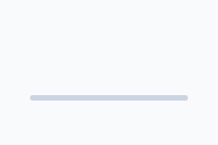 | Text elements are parsed but native text painting is not implemented. |
| Text | &lt;tspan&gt; | Model only |  | Text spans are parsed but not painted. |
| Text | &lt;textPath&gt; | Model only |  | TextPath references are parsed but text layout along paths is not painted. |
| Text | text x/y/dx/dy | Model only | 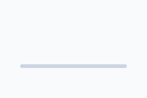 | Text positioning lists are model-only until text rendering exists. |
| Text | text rotate | Model only |  | Per-glyph text rotation is parsed but not painted. |
| Text | text-anchor | Model only |  | Text anchoring is parsed but not painted. |
| Text | dominant-baseline | Model only |  | Dominant baseline is parsed but not painted. |
| Text | alignment-baseline | Model only |  | Alignment baseline is parsed but not painted. |
| Text | white-space | Model only |  | Text whitespace handling is parsed but not painted. |
| Reuse, Linking, and Markers | href | Rendered |  | Unprefixed href works for simple &lt;use&gt; references. |
| Reuse, Linking, and Markers | xlink:href | Rendered |  | Deprecated xlink:href is preserved and works for simple &lt;use&gt; references. |
| Reuse, Linking, and Markers | &lt;marker&gt; | Model only |  | Marker definitions are parsed but marker painting is skipped. |
| Reuse, Linking, and Markers | marker-start | Model only |  | Start markers are parsed but not painted. |
| Reuse, Linking, and Markers | marker-mid | Model only |  | Mid markers are parsed but not painted. |
| Reuse, Linking, and Markers | marker-end | Model only | 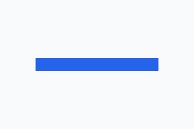 | End markers are parsed but not painted. |
| Reuse, Linking, and Markers | marker orient | Model only | 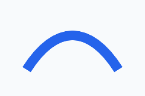 | Marker orientation is parsed but has no renderer effect. |
| Reuse, Linking, and Markers | markerUnits | Model only |  | Marker unit scaling is parsed but not painted. |
| Reuse, Linking, and Markers | marker viewBox | Model only |  | Marker viewBox data is parsed but not rendered. |
| Embedded and Dynamic SVG | &lt;foreignObject&gt; | Partial |  | The container's SVG children can render; embedded HTML is not painted. |
| Embedded and Dynamic SVG | &lt;animate&gt; | Static only |  | Animation records are parsed; the native view paints the initial static geometry only. |
| Embedded and Dynamic SVG | &lt;animateMotion&gt; | Static only |  | Motion animation is parsed but not executed. |
| Embedded and Dynamic SVG | &lt;animateTransform&gt; | Static only |  | Transform animation is parsed but not executed. |
| Embedded and Dynamic SVG | &lt;set&gt; | Static only |  | Set animation elements are parsed but do not mutate rendered output. |
| Embedded and Dynamic SVG | &lt;discard&gt; | Static only | 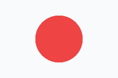 | Discard elements are parsed but do not remove rendered content. |
| Embedded and Dynamic SVG | &lt;mpath&gt; | Static only |  | Motion path references are parsed but not animated. |
